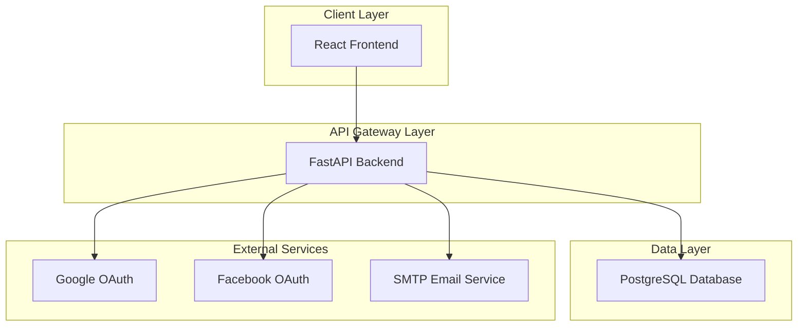

# Auth System

This project is a comprehensive user authentication system built from scratch with a loosely coupled architecture. It supports traditional email/password registration with email verification, as well as OAuth integration for Google and Facebook.

## Architecture

The system is designed with a modern, decoupled architecture:

- **Frontend**: React
- **Backend**: Python (FastAPI)
- **Database**: PostgreSQL
- **Containerization**: Docker

This setup allows for independent development, deployment, and scaling of the frontend and backend services.

### High-Level Diagram



## Getting Started

### Prerequisites

- Docker
- Docker Compose
- Git

### Setup

1. **Clone the repository:**
   ```bash
   git clone https://github.com/SudheerNarra7/SpecCoding.git
   cd auth-system
   ```
2. **Set up environment variables:**
   - Create `.env` files for the backend and frontend by copying the `.env.example` files.
   - Populate the `.env` files with your specific configuration.

3. **Build and run the application:**
   ```bash
   docker-compose up --build
   ```
4. **Access the application:**
   - Frontend: `http://localhost:3000`
   - Backend API: `http://localhost:8000/docs`